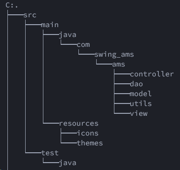
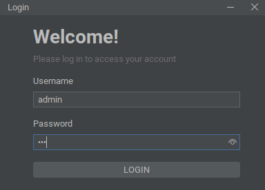

# Apartment management system
## Tổng quan

- Bài làm của nhóm 15
- Thành viên: Nguyễn Nhật Minh, Đỗ Tùng Dương, Nguyễn Việt Quang
- Lớp: Lập trình hướng đối tượng-1-2-23(N03)

## Cấu trúc dự án

## Đăng nhập
- Tài khoản: admin
- Mật khẩu: 123

## Các chức năng
- Hiển thị dữ liệu dưới dạng bảng.
- Thêm, sửa, xóa thông tin căn hộ.
- Tìm kiếm động.
- Sắp xếp (ấn vào tên cột)

## Các thư viện sử dụng trong dự án
- MigLayout để thiết kế bố cục.
- FlatLaf để tạo theme.
- XML để trích xuất dữ liệu.

